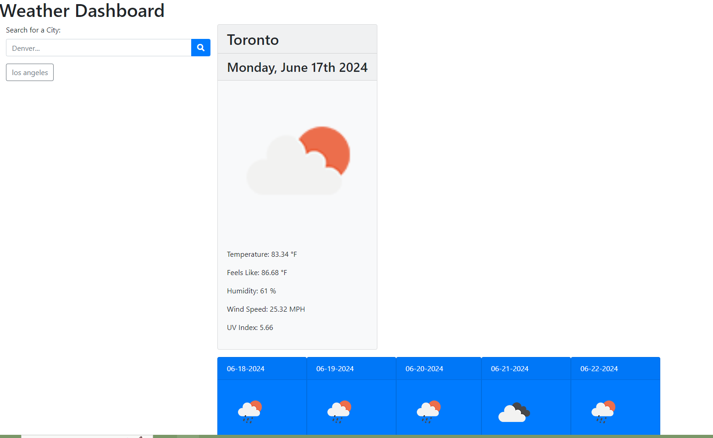

# Weather Dashboard

## Table of Contents

- [Description](#description)
- [Installation](#installation)
- [Usage](#usage)
- [Features](#features)
- [Technologies Used](#technologies-used)
- [License](#license)
- [Contributing](#contributing)
- [Contact](#contact)

## Description

The Weather Dashboard is a web application that provides current weather information and a five-day forecast for any city. Users can search for a city and see detailed weather information, including temperature, humidity, wind speed, and UV index. The application also maintains a search history, allowing users to quickly access weather data for previously searched cities.

## Installation

1. Clone the repository:
    ```bash
    git clone https://github.com/yourusername/weather-dashboard.git
    ```

2. Navigate to the project directory:
    ```bash
    cd weather-dashboard
    ```

3. Open `index.html` in your web browser to run the application.

## Usage

1. Open the application in your web browser.
2. Enter a city name in the search input field and click the search button.
3. View the current weather and five-day forecast for the specified city.
4. Click on any city button in the search history to view its weather information again.

## Features

- **Current Weather:** Displays the current temperature, feels-like temperature, humidity, wind speed, and UV index.
- **Five-Day Forecast:** Provides a five-day weather forecast, including temperature, feels-like temperature, and humidity.
- **Search History:** Maintains a history of searched cities, allowing users to quickly access weather data for these cities.



## Technologies Used

- HTML
- CSS
- JavaScript
- jQuery
- Bootstrap
- OpenWeatherMap API
- Moment.js

## License

This project is licensed under the MIT License.

## Contributing

Contributions are welcome! Please follow these steps:

1. Fork the repository.
2. Create a new branch (`git checkout -b feature-branch`).
3. Make your changes and commit them (`git commit -m 'Add some feature'`).
4. Push to the branch (`git push origin feature-branch`).
5. Open a Pull Request.

## Contact

For any questions or comments, please contact me at:

- **GitHub:** [jahncalabrese](https://github.com/jahncalabrese)

Thank you for using the Weather Dashboard!
